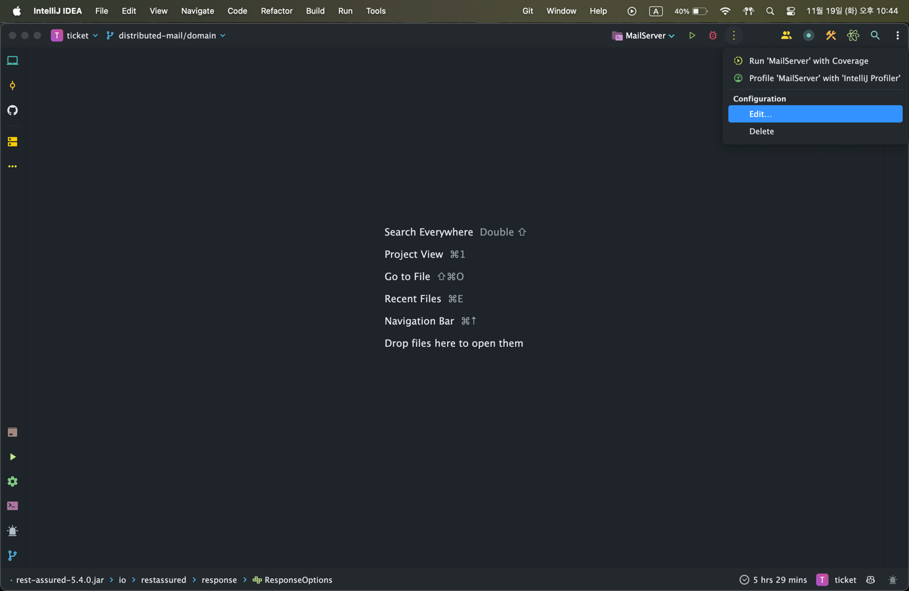
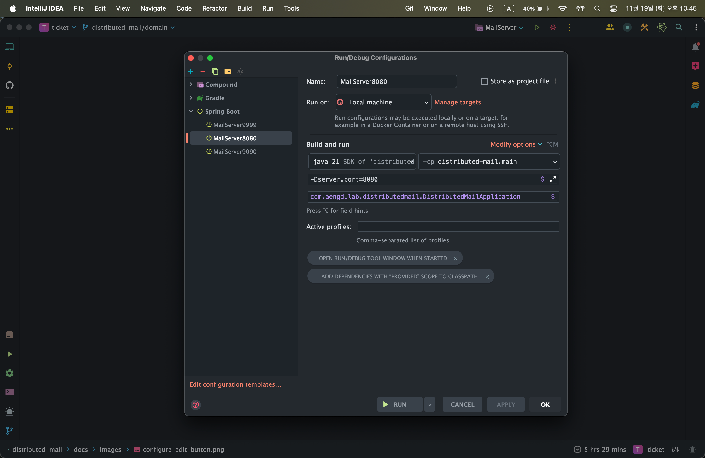
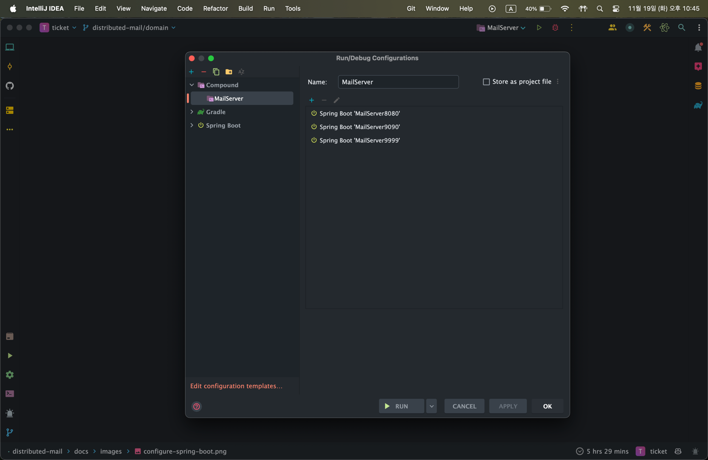

# 다중화된 메일 발송 시스템 구축

**목표**: 다중화된 환경에서 중복 발송 없는 안정적인 메일 발송 시스템을 구축한다.

---

## 요구사항

1. **메일 발송**
    - **매일 아침 9시**에 메일 발송을 시작한다.
    - 메일 발송 지연을 고려하여 메일 발송 요청은 **비동기**로 처리한다.

2. **메일 발송 요청 서버 다중화**
    - 메일 발송 요청은 **다중화된 환경**, 즉 2대 이상의 서버에서 발생한다.
    - 메일 발송 요청은 **균등하게 분배**한다.
    - 일부 서버가 다운되어도 **모든 사용자에게 메일을 발송**해야 한다.

3. **메일 중복 발송 방지**
    - 한 사용자에게 **중복으로 메일을 발송하지 않도록** 한다.
    - 중복 발송을 방지하기 위해 **메일 발송 이력을 저장**한다.

---

## 학습 방법

IntelliJ 기준으로 설명합니다. 

1. 터미널에서 도커 컨테이너를 실행합니다.
   ```shell
   docker compose up -d
   ```
   - 명령어 실행 경로는 [docker-compose.yml](./docker-compose.yml)가 존재해야 합니다. 
   - 위 명령어로 MySQL 서버와 SMTP 서버가 실행됩니다. 

2. Spring Boot 서버를 1대 이상 실행합니다. 
   - 포트는 8080, 9090, 9999를 기본으로 합니다. 
   - [MultiServerRequestTest.class](./src/test/java/com/aengdulab/distributedmail/MultiServerRequestTest.java)의 serverPorts 필드를 수정해서 서버를 다중화할 수 있습니다. 

3. [MultiServerRequestTest.class](./src/test/java/com/aengdulab/distributedmail/MultiServerRequestTest.java)의 `다중화된_서버에서_균등하고_중복_없이_모든_구독자에게_메일을_발송한다`를 통과시킵니다.

---

## IntelliJ에서 Spring Boot 서버 여러 대 실행하기

### 1. IntelliJ의 Run/Debug Configuration 창을 엽니다.



### 2. Spring Boot 서버를 설정합니다. 

- 이때 서버의 포트를 설정합니다. 
- Modify options 버튼을 눌러 VM 설정을 추가합니다. 
- 포트 설정은 -Dserver.port={포트번호} 형식으로 합니다. 



### 3. IntelliJ Compound를 설정합니다. 

- Compound를 설정하면 다중 서버를 편하게 관리할 수 있고, 선택 사항입니다.
- 이름은 자유롭게 설정합니다. 예시) MailServer
- 설정한 Spring Boot 서버를 모두 추가합니다.  



### 4. Compound를 실행합니다. 

- 설정한 모든 Spring Boot 서버를 한 번에 실행 및 종료할 수 있습니다. 
